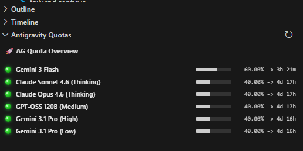

# Antigravity Quota Monitor

Since Google has hidden this inside alot of bullshit, I built this instead so I dont have to keep open two silly windows to see my quotas at any given time.

Anyway, here is the readme.md AI bullshit below, enjoy.

---------

A professional VS Code extension designed to provide real-time visibility into your Antigravity AI model usage quotas. Never get caught off guard by quota limits again.

## Features

- **Real-time Synchronization**: Automatically scans and connects to the local Antigravity Language Server.
- **Pro HUD Aesthetic**: High-fidelity UI with LED status indicators and segmented progress bars.
- **Precision Tracking**: Displays remaining quota with up to two decimal places.
- **Predictive Reset Times**: Shows exactly when your quota will refresh (e.g., "4d 17h").
- **Status Bar Integration**: Persistent HUD in the VS Code status bar showing your top models at a glance.

## Installation

1. Package the extension: `npx @vscode/vsce package`
2. Install the `.vsix` file:
   - Command Palette (`Ctrl+Shift+P`) -> **Extensions: Install from VSIX...**
   - Select `antigravity-quota-1.0.0.vsix`

## Usage

The extension automatically activates when you open a workspace. You can view the full dashboard in the **Explorer** view under the **Antigravity Quota Overview** section.

## Configuration

The extension automatically discovers the local server. Ensure your Antigravity IDE is running for real-time updates.

---
*Powered by Antigravity AI*
